# ML-Building-data — Machine Learning for Building Data (BENV0119 Coursework)

Coursework repository applying **supervised learning**, **unsupervised learning** and **reinforcement learning** to building energy and indoor environment data.

Tasks 1 and 2 use the **REFIT Smart Home dataset** (20 UK homes near Loughborough University, May 2012 – October 2015). Task 3 uses the **[pymgrid](https://github.com/Total-RD/pymgrid)** simulation environment to control a PV + battery + grid microgrid with Q-learning.

| Task | Learning paradigm | Problem | Headline result |
|---|---|---|---|
| 1A | Supervised — classification | Is gas being consumed in a half-hourly interval (0 / >0)? | Random Forest — Accuracy 0.6976, F1 0.5957 |
| 1B | Supervised — regression | Half-hourly gas volume (m³) | SVR (RBF) — R² 0.1979, RMSE 0.108608 m³ |
| 2 | Unsupervised — k-Means | Thermal-condition regimes from temperature + relative humidity | k = 3 clusters over 13,782 hourly records |
| 3 | Reinforcement — Q-learning | Minimise microgrid operating cost via battery/grid actions | Total testing cost **€38.64** over a 48-hour horizon |

---

## Table of contents

- [Repository structure](#repository-structure)
- [Data](#data)
- [Environment and how to run](#environment-and-how-to-run)
- [Task 1 — Supervised Learning](#task-1--supervised-learning)
  - [Subtask A — Binary classification](#subtask-a--binary-classification)
  - [Subtask B — Regression](#subtask-b--regression)
- [Task 2 — Unsupervised Learning (k-Means)](#task-2--unsupervised-learning-k-means)
- [Task 3 — Reinforcement Learning (Q-learning)](#task-3--reinforcement-learning-q-learning)
- [Report](#report)
- [Known gaps and items needing confirmation](#known-gaps-and-items-needing-confirmation)

---

## Repository structure

```
ML-Building-data/
├── BENV0019_Task1/
│   ├── BENV0119_Task1_Notebook.ipynb     # Task 1 — supervised learning (executed, with outputs)
│   └── BENV0119_Task1_Notebook.pdf       # PDF export of the executed notebook
├── BENV0019_Task2/
│   ├── BENV0119_Task2_Notebook.ipynb     # Task 2 — k-Means clustering (executed, with outputs)
│   └── BENV0119_Task2_Notebook.html      # HTML export of the executed notebook
├── BENV00119_Task3/
│   └── task_3_folder/
│       ├── README.md                     # Task 3 problem statement (course-provided brief)
│       ├── helper_functions.py           # epsilon-greedy policy, max_dict, epsilon decay, utilities
│       ├── customized_data/data/         # pymgrid inputs: load, PV and CO2 time series
│       ├── figures/                      # Environment.png, QlearningAlgo.png (course-provided)
│       └── .ipynb_checkpoints/
│           └── task_3-checkpoint.ipynb   # Task 3 notebook (checkpoint copy — see note below)
├── assets/                               # Exported result figures referenced in this README
├── data/
│   ├── ReadMe.txt                        # Official REFIT dataset documentation and citation
│   ├── REFIT_BUILDING_SURVEY.xml         # REFIT building/sensor metadata (variable IDs → sensors)
│   └── building02_wide.csv               # Wide-format half-hourly table (see note below)
├── report/
│   └── Report.pdf                        # Full coursework report: code, outputs and written analysis
└── .gitignore
```

> **Note on the Task 3 notebook.** `.gitignore` excludes `task_3.ipynb`, so the only version of the Task 3 notebook tracked in this repository is the Jupyter checkpoint copy at `BENV00119_Task3/task_3_folder/.ipynb_checkpoints/task_3-checkpoint.ipynb`. The Task 3 code and outputs described below are taken from that checkpoint and from `report/Report.pdf`.

---

## Data

### REFIT Smart Home dataset (Tasks 1 and 2)

From `data/ReadMe.txt`: the REFIT project ran from May 2012 to October 2015 as a collaboration between Loughborough University, the University of Strathclyde and the University of East Anglia, studying smart-home technologies in 20 UK homes. The dataset contains 25,312,397 time-series readings from 1,567 sensors across 389 rooms.

Citation: Firth, Steven; Kane, Tom; Dimitriou, Vanda; Hassan, Tarek; Fouchal, Farid; Coleman, Michael; Webb, Lynda. *REFIT Smart Home dataset.* figshare. https://dx.doi.org/10.17028/rd.lboro.2070091

Both notebooks read the main measurement file:

```python
data = './data/REFIT_TIME_SERIES_VALUES.csv'
```

**This CSV (~25.3 M rows) is not tracked in the repository** — it is excluded by `.gitignore`. Download it from the figshare link above and place it in `data/` before running Tasks 1 or 2.

Sensor variables are addressed by their REFIT `TimeSeriesVariable/@id`. The IDs used in the notebooks resolve as follows in `data/REFIT_BUILDING_SURVEY.xml`:

| Variable ID | `variableType` (from XML) | Units | Scope in XML | Notebook column |
|---|---|---|---|---|
| `TimeSeriesVariable1554` | Gas volume | m³ | Building01 | `Gas_m3` (Task 1 target) |
| `TimeSeriesVariable1573` | Air temperature | Deg C | Climate (Loughborough campus weather station) | `Ext_Temp_C` (Task 1) / `Temperature_C` (Task 2) |
| `TimeSeriesVariable1574` | Relative humidity | % | Climate (Loughborough campus weather station) | `Ext_Humidity_pct` (Task 1) / `Relative_Humidity_pct` (Task 2) |
| `TimeSeriesVariable15` | Air temperature | C | Building01 | `Int_Temp_C` (Task 1) |
| `TimeSeriesVariable576` | Relative humidity | % | Building01 | `Int_Humidity_pct` (Task 1) |
| `TimeSeriesVariable2193` | *(variableType not resolved from XML)* | — | Building01 | `Motion` (Task 1) |
| `TimeSeriesVariable432` | Intensity | Lux | Building01 | `Light_Lux` (Task 1) |
| `TimeSeriesVariable1584` | Electrical power | W | Building01 | `Elec_W` (Task 1) |

### pymgrid inputs (Task 3)

`BENV00119_Task3/task_3_folder/customized_data/data/` holds three 8,760-row (hourly, one year) series used by the pymgrid `MicrogridGenerator`:

- `load/RefBldgFullServiceRestaurantNew2004_v1.3_7.1_6A_USA_MN_MINNEAPOLIS.csv` — `Electricity:Facility [kW](Hourly)`
- `pv/SanFrancisco_724940TYA.csv` — `GH illum (lx)`
- `co2/co2_caiso.csv` — `CO2_CISO_I_kwh`

---

## Environment and how to run

The notebooks were executed on a conda environment named `benv0119`, **Python 3.10.19**.

**Tasks 1 and 2** — pandas, numpy, matplotlib, seaborn, scikit-learn:

```bash
pip install pandas numpy matplotlib seaborn scikit-learn
```

**Task 3** — the customised pymgrid fork used by the course brief:

```bash
pip install git+https://github.com/Wenuka/pymgrid/
```

Both Task 1 and Task 2 notebooks reference the dataset as `./data/REFIT_TIME_SERIES_VALUES.csv`, i.e. relative to the working directory rather than to the notebook's own folder — run them with the repository root as the working directory, or adjust the path. Task 3 imports `helper_functions` and reads `./customized_data`, so it must be run from inside `BENV00119_Task3/task_3_folder/`.

---

## Task 1 — Supervised Learning

**Aim (from the report):** compare the performance (accuracy and run time) of two or more machine learning algorithms covered in the lectures — training models to predict energy consumption from input features, evaluating accuracy and run time on validation and test data, and establishing the best-performing algorithm for this data. The report frames this in a smart-buildings context: predicting energy consumption from living-condition data such as temperature, humidity and external weather to determine how much energy is used to sustain the building.

**Dataset used:** REFIT **Building 1 (Building01)**, gas volume as the target, with weather-station and in-home sensor variables as features.

### Data preparation

| Step | What was done |
|---|---|
| Extraction | Each `TimeSeriesVariable` filtered by ID, timestamps parsed as UTC, resampled to **30-minute means**, merged on the datetime index → shape **(28,800, 8)** |
| Cleaning | Negative gas readings clipped to 0; rows with missing gas dropped; remaining feature gaps forward-filled then backward-filled (the report justifies this as appropriate for slowly-changing sensor signals) |
| Feature engineering | `Hour`, `Month`, `DayOfWeek`, `IsWeekend`, `HalfHour`, plus cyclical encodings `Hour_sin/cos` and `Month_sin/cos` |
| Result | Clean shape **(28,704, 17)**, date range **2013-09-14 → 2015-05-06**, mean gas 0.0728 m³, max 0.74 m³, **64.25 % of readings are zero** |

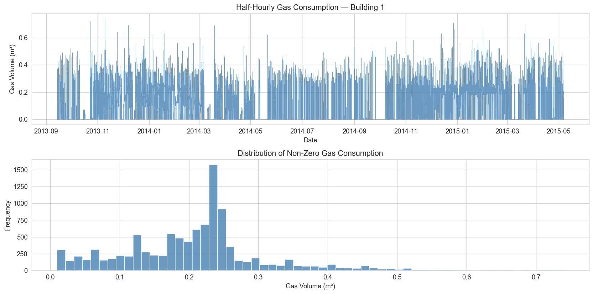

### Feature selection

Feature selection uses Pearson correlation between each candidate feature and gas consumption; the report treats `|r| > 0.1` as informative.

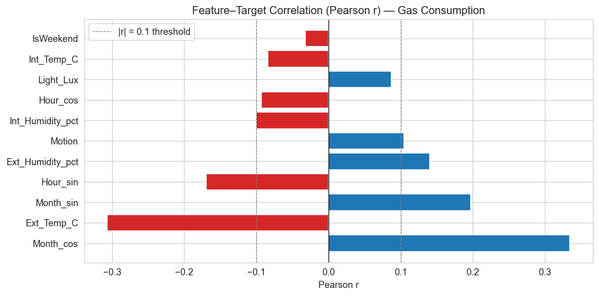

| Feature | Pearson *r* | | Feature | Pearson *r* |
|---|---|---|---|---|
| `Month_cos` | 0.3346 | | `Int_Humidity_pct` | −0.1003 |
| `Ext_Temp_C` | −0.3065 | | `Hour_cos` | −0.0930 |
| `Month_sin` | 0.1969 | | `Light_Lux` | 0.0870 |
| `Hour_sin` | −0.1698 | | `Int_Temp_C` | −0.0843 |
| `Ext_Humidity_pct` | 0.1402 | | `IsWeekend` | −0.0322 |
| `Motion` | 0.1044 | | `Elec_W` | NaN |

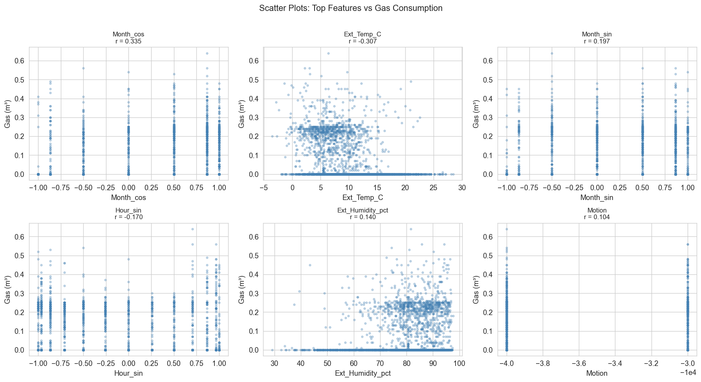

**10 features** were retained (`|r| > 0.05`, with the four cyclical time features kept on domain grounds): `Ext_Temp_C`, `Ext_Humidity_pct`, `Int_Temp_C`, `Int_Humidity_pct`, `Motion`, `Light_Lux`, `Hour_sin`, `Hour_cos`, `Month_sin`, `Month_cos`.

### Train / validation / test split

The split is **chronological, not random** — as the report states, shuffling time-series data would leak future information into training.

| Split | Share | Samples | Purpose |
|---|---|---|---|
| Training | first 70 % | 20,092 | Model fitting |
| Validation | next 15 % | 4,306 | Hyperparameter tuning |
| Test | final 15 % | 4,306 | Held-out evaluation |

Training-set class balance: **Gas = 0 → 14,153 (70.4 %)**, **Gas > 0 → 5,939 (29.6 %)**. Features were standardised with `StandardScaler` **fitted on the training set only**. For final evaluation, training and validation sets were recombined and the models refit before predicting on the test set.

---

### Subtask A — Binary classification

**Objective:** predict whether gas consumption in each 30-minute interval is `0` (no gas used) or `>0` (gas being consumed).

**Algorithms (theory as given in the report):**

- **Logistic Regression (baseline)** — a natural benchmark for binary classification; uses the sigmoid function to obtain class probabilities.
- **Random Forest Classifier** — multiple decision trees; handles non-linear interactions between features, e.g. cold outdoor temperature *and* night-time hour jointly predicting gas use better than either alone.
- **K-Nearest Neighbours** — identifies the *k* closest data points to an input and predicts from the majority class of those neighbours.

**Hyperparameter sensitivity** (tuned on the validation set by F1):

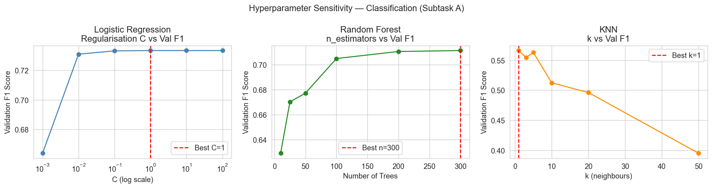

| Model | Grid searched | Best value | Validation F1 |
|---|---|---|---|
| Logistic Regression | C ∈ {0.001, 0.01, 0.1, 1, 10, 100} | **C = 1** | 0.7332 |
| Random Forest | n_estimators ∈ {10, 25, 50, 100, 200, 300} | **n = 300** | 0.7114 |
| KNN | k ∈ {1, 3, 5, 10, 20, 50} | **k = 1** | 0.5661 |

**Test-set results:**

| Model | Accuracy | F1 | Train time (s) | Predict time (s) | TP | TN | FP | FN |
|---|---|---|---|---|---|---|---|---|
| Logistic Regression | 0.6965 | 0.4912 | 0.0248 | 0.0004 | 631 | 2368 | 300 | 1007 |
| **Random Forest** | **0.6976** | **0.5957** | 0.7877 | 0.0268 | 959 | 2045 | 623 | 679 |
| K-Nearest Neighbours | 0.5961 | 0.5036 | 0.0183 | 0.0642 | 882 | 1685 | 983 | 756 |

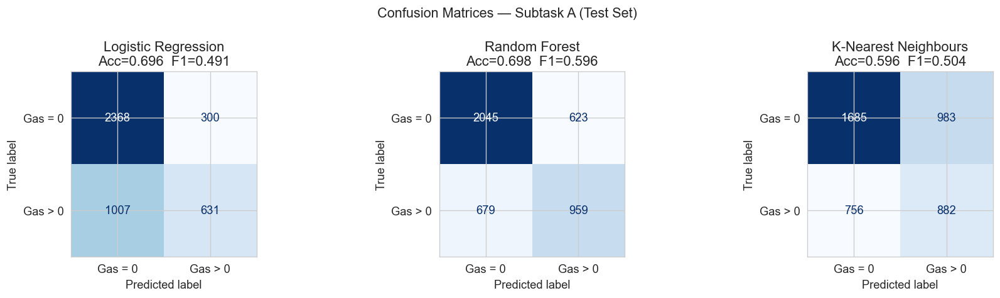

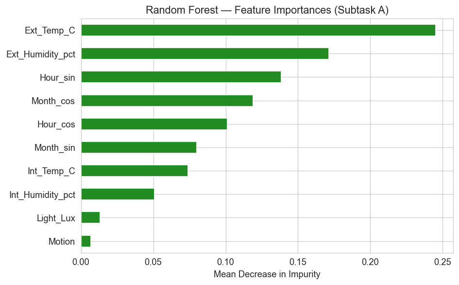

**Analysis (from the report):** Random Forest achieves the highest accuracy and F1 of the three classifiers, with KNN next and Logistic Regression as the linear baseline. This is expected, because gas use is non-linear and varies with the seasons, and a linear decision boundary cannot fully capture that complexity. Since zero-gas readings far outnumber non-zero ones, accuracy alone is not a good measure — F1, which balances precision and recall, is the more appropriate metric here, and Random Forest's ensemble of trees handles the imbalance well. On run time, Logistic Regression is by far the fastest to train and predict, which makes it a good choice for real-time applications where speed and interpretability matter more than maximum accuracy.

---

### Subtask B — Regression

**Objective:** predict half-hourly gas consumption (m³) as a continuous value.

**Algorithms (theory as given in the report):**

- **Linear Regression (baseline)** — models the relationship between the dependent variable (half-hourly gas consumption) and independent variables (temperature, humidity, etc.) by fitting the best-fit straight line.
- **Random Forest Regressor** — the same ensemble principle as the classifier, with each tree predicting a continuous value and the final prediction being the mean across all trees.
- **Support Vector Regression (RBF kernel)** — fits a function within a defined error margin, using kernel functions to capture both linear relationships and complex non-linear patterns.

Predictions are clipped at zero, since gas consumption cannot be negative.

**Hyperparameter sensitivity** (tuned on the validation set by RMSE):

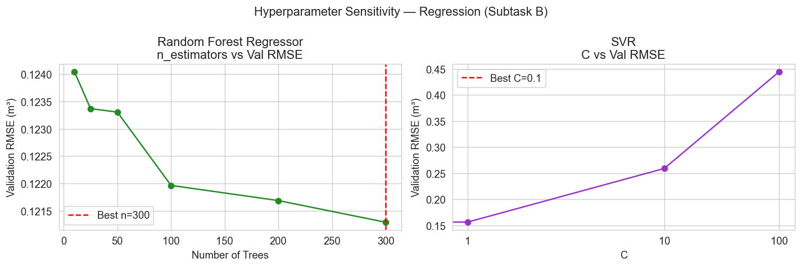

| Model | Grid searched | Best value | Validation RMSE (m³) |
|---|---|---|---|
| Random Forest Regressor | n_estimators ∈ {10, 25, 50, 100, 200, 300} | **n = 300** | 0.121287 |
| SVR (RBF, ε = 0.01) | C ∈ {0.1, 1, 10, 100} | **C = 0.1** | 0.155662 |

**Test-set results:**

| Model | RMSE (m³) | CV-RMSE (%) | MAE (m³) | R² | Train time (s) | Predict time (s) |
|---|---|---|---|---|---|---|
| Linear Regression | 0.113034 | 137.50 | 0.084539 | 0.1311 | 0.0086 | 0.0006 |
| Random Forest Regressor | 0.113910 | 138.57 | 0.080582 | 0.1176 | 1.6349 | 0.0268 |
| **SVR (RBF)** | **0.108608** | **132.12** | **0.074524** | **0.1979** | 6.9518 | 1.3525 |

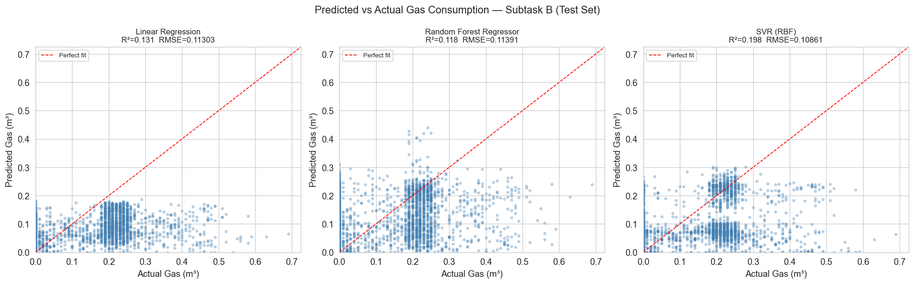

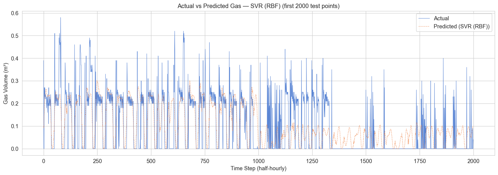

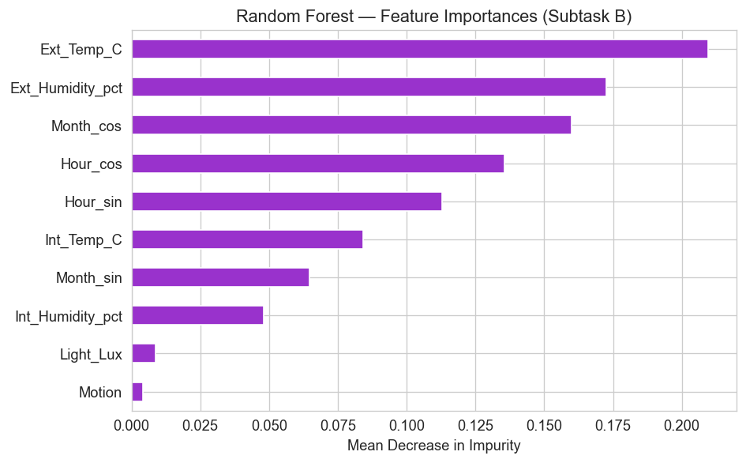

**Analysis (from the report):** the report's conclusion states that the Random Forest Regressor achieves the best R² and lowest RMSE, confirming the non-linear relationships found during feature selection — in particular the interaction between month/season and outdoor temperature. Linear Regression works as a starting point but cannot represent threshold effects such as heating switching on below a certain temperature. SVR with an RBF kernel handles some non-linearity but is sensitive to hyperparameter choice and expensive to tune.

> `[TODO / INFORMATION NEEDED]` — The executed notebook outputs and the results table in the report both show **SVR (RBF)** with the best R² (0.1979) and lowest RMSE (0.108608 m³), while the report's written conclusion names the Random Forest Regressor as best. The time-series figure, which plots the best model by R², is titled *SVR (RBF)*. This inconsistency between the written conclusion and the recorded results should be resolved.

---

## Task 2 — Unsupervised Learning (k-Means)

**Background (from the report):** in unsupervised learning the algorithm receives unlabelled data and must find the data's inherent structure, patterns or groupings; there is no target variable to predict. Clustering divides a dataset into groups so that observations within a cluster are more alike than observations in other clusters. In smart buildings, clustering can reveal operational regimes, occupancy patterns or thermal comfort states without labelled training data.

**Hypothesis (from the report):** the thermal conditions of Building 01, defined by air temperature and relative humidity, vary according to season and occupancy — cold unheated/unoccupied periods, mild transitional periods, and warm/summer periods — and these clusters should align with real-world conditions.

**Variables used:** two, both resampled to **hourly means**, with missing rows dropped:

| Variable ID | Description | Units | Justification (from the report) |
|---|---|---|---|
| `TimeSeriesVariable1573` | Air temperature (main room) | °C | Directly characterises thermal comfort |
| `TimeSeriesVariable1574` | Relative humidity | % | Complements temperature for the full thermal state |

The report justifies choosing these over other climate data because they reflect the thermal conditions and comfort experienced by occupants inside the building, which is most relevant for assessing thermal comfort in building energy management.

**Resulting dataset:** 25,312,397 raw rows → **13,782 merged hourly records**, spanning **2013-11-04 09:00 → 2015-06-01 14:00 UTC**.

| | Temperature (°C) | Relative humidity (%) |
|---|---|---|
| mean | 9.95 | 80.53 |
| std | 5.37 | 12.50 |
| min | −3.58 | 29.91 |
| 25 % / 50 % / 75 % | 5.94 / 9.32 / 13.53 | 74.15 / 83.58 / 90.10 |
| max | 30.90 | 97.80 |

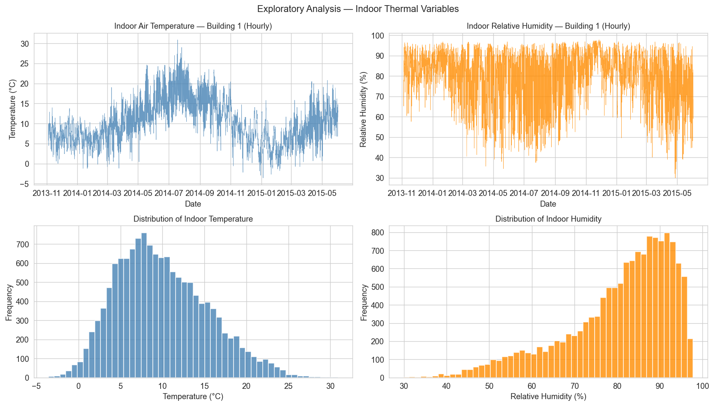

### Method

**Theory (from the report):** k-Means groups items into *k* clusters of similarity using Euclidean distance, minimising the Within-Cluster Sum of Squares (WCSS, or inertia). The algorithm initialises *k* centroids, assigns each point to its nearest centroid, recomputes each centroid as the mean of its members, and repeats until the centroids stop changing or the iteration limit is reached.

Both features were standardised with `StandardScaler`. The report notes this is essential because temperature and humidity have very different scales — without standardisation, humidity would dominate the Euclidean distance metric. The model was fit with `KMeans(n_clusters=3, init='k-means++', n_init=10, random_state=42)`.

### Choosing k

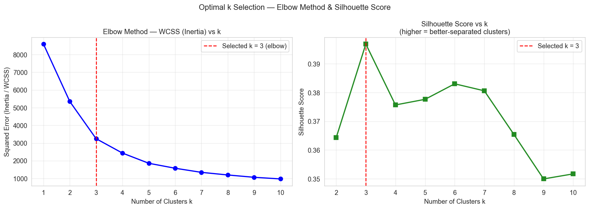

**Justification for k = 3 (from the report):** the elbow plot shows inertia decreasing sharply from k=2 to k=4, after which the reduction becomes marginal, so k=3 was selected — further clusters yield diminishing returns in explained variance. Physically, k=3 is also interpretable for building thermal conditions: a cold/high-humidity state (winter or unheated), a warm/moderate-humidity state (summer or heated), and a mild/transitional state (spring/autumn or partially heated).

### Results — cluster centroids (original, unscaled units)

| Cluster | Temperature (°C) | Relative humidity (%) | Count | Share |
|---|---|---|---|---|
| 0 | 5.31 | 85.68 | 6,310 | 45.8 % |
| 1 | 16.30 | 60.30 | 2,729 | 19.8 % |
| 2 | 12.44 | 85.35 | 4,743 | 34.4 % |

Clusters are labelled by ascending centroid temperature: **Cluster 0 → Cold & Humid**, **Cluster 2 → Mild & Transitional**, **Cluster 1 → Warm & Dry**.

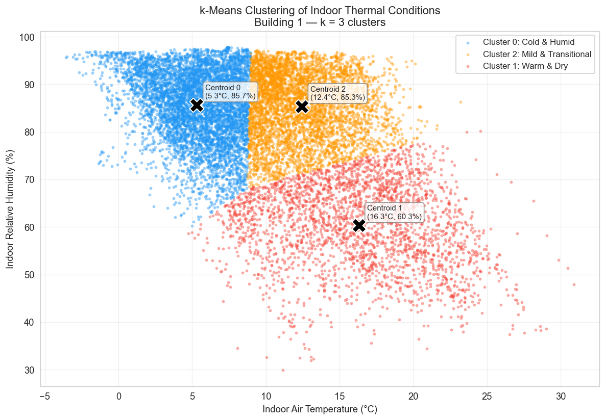

### Temporal validation

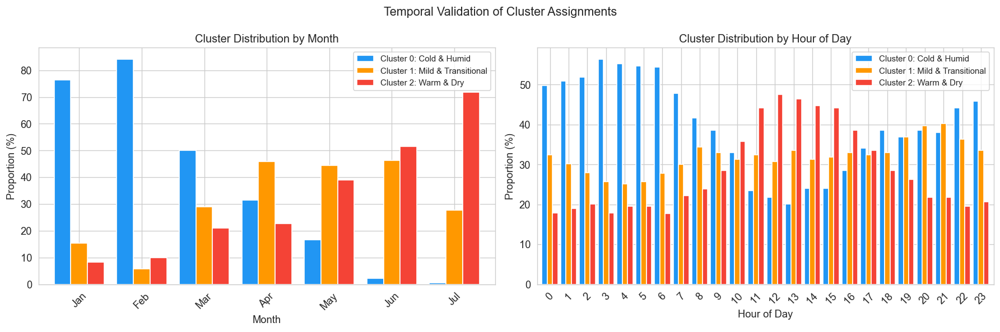

**Analysis (from the report):** the temporal analysis confirms the physical interpretation of the clusters — the Cold & Humid cluster is predominantly observed in winter months (Nov–Feb), the Warm & Dry cluster peaks in summer months (Jun–Aug), and the Mild & Transitional cluster spans spring and autumn. The report interprets the three states as winter/unheated periods where outdoor cold drives indoor humidity up while heating is off; spring/autumn or partially-heated periods; and summer or actively-heated periods where heating dries the indoor air.

**Hypothesis validation (from the report):** the initial hypothesis was confirmed — thermal conditions do divide according to seasonal change and reflect thermal comfort within the building, with the three clusters corresponding to the seasonal regimes experienced.

> `[TODO / INFORMATION NEEDED]` — The cluster→label mapping is stated inconsistently in the report. The summary table in Step 9 lists Cluster 1 as *Mild & Transitional* and Cluster 2 as *Warm & Dry*, whereas the code assigns labels by ascending centroid temperature (Cluster 2 = Mild & Transitional, Cluster 1 = Warm & Dry). The report's Conclusion introduces a third set of names again (*Cold & Dry*, *Warm & Humid*). These should be reconciled to a single naming.

---

## Task 3 — Reinforcement Learning (Q-learning)

**Problem statement (from `BENV00119_Task3/task_3_folder/README.md`):** manage the energy flow of a building powered by a solar PV system with battery storage, using the pymgrid simulation environment and the problem posed by [Wenuka](https://github.com/Wenuka/RL_for_energy_tutorial). When PV generation is insufficient for demand, the main grid supplies the mismatch at a time-varying price, and the cost of CO₂ produced by the grid at that time is also included. The task is to charge or discharge the battery accordingly so that overall cost is minimised, using Q-learning with fine-tuned hyperparameters.

### Environment setup

- Microgrid architecture: `{'PV': 1, 'battery': 1, 'genset': 0, 'grid': 1}` — no generator set.
- **States.** The environment provides four (building load kW, PV kW, grid connectivity, battery state of charge). Grid connectivity is always 1 and can be dropped; load and PV are combined into **net load** (`load − pv`). The state is therefore reduced from four variables to two — **net load (kW)** and **battery SOC (%)** — to improve learning efficiency.
- **Discretisation.** Net load is rounded to the nearest 0.5 kW and SOC to the nearest 0.1. Over a full year the net load ranges from **−1.71 kW to 5.32 kW**, giving a **Q-table of 72 states × 4 actions**, initialised to zero.
- **Actions.** `0: battery_charge`, `1: battery_discharge`, `2: grid_import`, `3: grid_export`. Action 0 is blocked at SOC = 1 and action 1 at SOC = 0.2; charge/discharge magnitudes are capped by remaining capacity and charge/discharge rate.
- **Reward.** Defined as the negative cost, so maximising reward minimises cost. The environment's cost combines grid electricity purchase, battery cycle cost derived from battery life, and a CO₂ emissions penalty. A fixed `+35` reward adjustment is applied on the charge action (course-provided, unmodified).

### Implementation

`helper_functions.py` supplies `espilon_decreasing_greedy` (ε-greedy action selection), `max_dict` (greedy action and value lookup) and `update_epsilon` (multiplicative decay of 2 % per episode, floored at 0.1).

The parts of the notebook to be completed were the Q-table initialisation, state count, the update rule and the state transition. The implemented update is the standard off-policy Q-learning rule:

```python
Q[s][a] = Q[s][a] + alpha * (r + gamma * max_dict(Q[s_])[1] - Q[s][a])
s = s_
```

Training used `mg0.train_test_split(train_size=0.4)`, a **48-hour horizon** and **300 episodes** per run.

### Hyperparameter comparison

| Run | α (learning rate) | ε (exploration) | γ (discount) | Total testing cost |
|---|---|---|---|---|
| Run 1 | 0.1 | 0.9 | 0.99 | €38.64 |
| Run 2 | 0.5 | 0.5 | 0.5 | €54.60 |
| Run 3 | 0.9 | 0.7 | 0.8 | €38.64 |

**Testing result: total cost €38.64** over the 48-hour test horizon.

### Discussion (answers as written in the report)

**Q1 — How the optimal hyperparameter set was chosen.** All three sets had converged together by around episode 100, but their testing costs differed: Run 1 (α = 0.1) and Run 3 (α = 0.9) both gave €38.64, while Run 2 (α = 0.5) gave €54.60. **Q1 was chosen**, because a low learning rate makes Q-value updates more stable — large α values can make Q-values unstable in later episodes, while very low α values converge reliably even if more slowly.

**Q2 — Why SARSA is on-policy and Q-learning is off-policy.** SARSA is on-policy because it updates using the next action actually taken under the same policy — the policy being evaluated and the policy being followed are the same: `Q[s][a] += alpha*(r + gamma*Q[s'][a'] - Q[s][a])`, where `a'` follows the same ε-greedy policy. Q-learning instead updates towards the maximum Q-value of the next state regardless of the action actually taken, evaluating the greedy policy while following an exploratory one: `Q[s][a] += alpha*(r + gamma*max_dict(Q[s_])[1] - Q[s][a])`.

> `[TODO / INFORMATION NEEDED]` — The task brief asks for **four** discussion questions; only questions 1 and 2 appear in `report/Report.pdf` and in the tracked checkpoint notebook. Questions 3 and 4 and their answers are missing from the repository.

> `[TODO / INFORMATION NEEDED]` — The testing call differs between sources: `report/Report.pdf` shows `testing_Q_Learning(mg0, Q1, 48)`, while the tracked checkpoint notebook shows `testing_Q_Learning(mg0, Q3, 48)`. Both record a total cost of €38.64, consistent with the report's statement that Run 1 and Run 3 produced the same cost, but the intended submission version should be confirmed.

> `[TODO / INFORMATION NEEDED]` — No exported Task 3 result figures (training-reward comparison, cost-over-time with state/action annotations) are present in `assets/`; they exist only as inline outputs in the checkpoint notebook and in the report PDF.

---

## Report

`report/Report.pdf` (37 pages) contains the full coursework submission for all three tasks: introduction and aims, the theory and formulae behind each algorithm, every code cell with its executed output, the result figures, and the written analysis and conclusions. The task-by-task explanations quoted throughout this README are drawn from it.

---

## Known gaps and items needing confirmation

Items that could not be verified from the repository alone:

1. `[TODO / INFORMATION NEEDED]` **Root `ReadMe.md` is empty.** This README is intended to replace it.
2. `[TODO / INFORMATION NEEDED]` **Author, module and submission details** — module code appears as `BENV0119` in the notebook filenames and as `BENV0019`/`BENV00119` in the task folder names; the Task 3 brief refers to `BENV0119_CW`. Student name, module title, institution, submission year and grade are not stated anywhere in the repository.
3. `[TODO / INFORMATION NEEDED]` **Licence** — no `LICENSE` file is present, and no reuse terms are stated.
4. `[TODO / INFORMATION NEEDED]` **`data/building02_wide.csv`** (31,888 half-hourly rows: gas, per-room temperature/humidity for rooms 1a–3c, outdoor temperature, humidity, wind speed, solar irradiance, rainfall, pressure) is committed but is not referenced by any tracked notebook or script. Its role in the project is unclear.
5. `[TODO / INFORMATION NEEDED]` **Variable scope in Task 2** — the Task 2 notebook and report describe `TimeSeriesVariable1573`/`1574` as *indoor* air temperature and relative humidity, but in `data/REFIT_BUILDING_SURVEY.xml` both sit under the `Climate` element sourced from the Loughborough University campus weather station. The Task 1 notebook names the same two IDs `Ext_Temp_C` and `Ext_Humidity_pct`. The intended interpretation should be confirmed.
6. `[TODO / INFORMATION NEEDED]` **Subtask B algorithm list** — the report's theory section says Linear Regression will be compared to *Decision Tree, SVR and Neural Network*, while the implemented and reported models are Linear Regression, Random Forest Regressor and SVR.
7. `[TODO / INFORMATION NEEDED]` **Building number in Subtask A** — the report's theory section refers to predicting gas consumption for *building number 2*, while the dataset section and all code use Building 1 (Building01).
8. `[TODO / INFORMATION NEEDED]` **Two assets have no corresponding code in the tracked notebooks** — `subtaskA_feature_importance.png` and `subtaskB_feature_importance.png` (Random Forest mean-decrease-in-impurity charts), and the silhouette-score panel of `task2_elbow_silhouette.png`. The tracked Task 2 notebook imports `silhouette_score` but only plots the elbow curve; the hour-of-day panel of `task2_temporal_analysis.png` likewise has no counterpart cell. These figures appear to come from an earlier or extended run of the analysis.
9. `[TODO / INFORMATION NEEDED]` **Reproducibility** — no `requirements.txt` or `environment.yml` is committed; the package versions above are inferred from notebook metadata and the install cell in the Task 3 notebook.